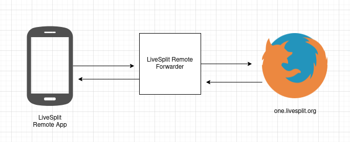

# LiveSplit Remote Forwarder

This is used like so:



By running this script it is possible to control one.livesplit.org with the Android LiveSplit Remote app.

## Usage

```bash
$ npm install
$ node forward.js
```

Once the script is running go to one.livesplit.org and click 'Connect to Server'.

Enter `ws://localhost:8055` to connect.

Once connection is established you can open the Android LiveSplit app and connect to your computer's local IP.